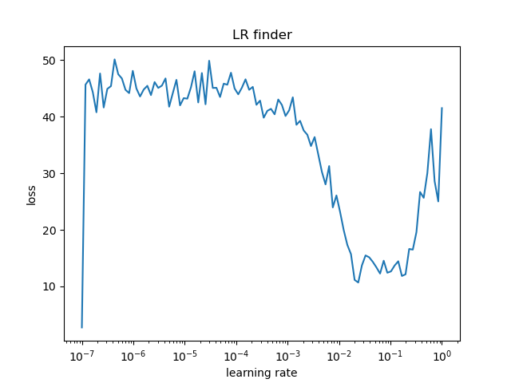

# addGPT: Teaching a Transformer to Add Numbers

addGPT is an educational, end-to-end implementation of a transformer encoder–decoder that learns to perform integer addition directly on string-encoded numbers. The project is designed to explore how transformers can learn simple algorithmic tasks while maintaning modern deep learning engineering patterns in PyTorch (config-driven training, experiment management and hyperparameter search).

<p align="center">
  
</p>

## Overview

The model treats addition as a sequence-to-sequence problem:

- Input: a zero-padded addition problem as a string, e.g. `00123+00456=`
- Output: the sum as a string, generated digit by digit

Rather than using built-in numeric operations, the transformer learns to perform the addition procedure from data. With a small configuration (~2.7M parameters), it can achieve very high accuracy on 5-digit addition (up to `99999+99999`).

## Motivation

This project serves two main purposes:

- **Conceptual** – Show that a transformer can learn a simple algorithmic task (addition) from examples, and visualize how attention behaves on such problems.  
- **Engineering** – Provide a compact but realistic deep learning codebase that follows modern practices: PyTorch, Hydra configs, Optuna-based hyperparameter search, TensorBoard logging and a clear project structure.

## Key Features

- **Transformer Encoder–Decoder Architecture**  
  Encoder–decoder model in PyTorch with token and positional embeddings, causal self-attention in the decoder and cross-attention to the encoded problem.

- **Algorithmic Learning Setup**  
  The model learns addition digit by digit from string inputs (e.g. `"12345+67890="`), with reversed targets to mirror human right-to-left addition and carrying.

- **Multiple Attention Implementations**  
  Switch between PyTorch’s optimized `MultiheadAttention` and a custom attention implementation to better understand how attention works internally.

- **Config-Driven Experiments**  
  Hydra-based configuration system (YAML configs for data, model and training) so experiments are reproducible and easy to vary from the command line.

- **Hyperparameter Optimization**  
  Integrated Optuna search for key hyperparameters (learning rate, embedding size, number of heads/blocks, batch size, etc.), with TensorBoard logging.

- **On-the-Fly Dataset Generation**  
  Random addition problems are generated during training, with configurable maximum digit length and formatting.

## Tech Stack

- **Core**: Python 3, PyTorch  
- **Configuration**: Hydra  
- **Experiment Management**: TensorBoard, Optuna  
- **Utilities**: NumPy, Hugging Face Hub (for hosting checkpoints)

## Project Structure

```text
addGPT/
├── README.md                  # Project description
├── LICENSE                    # Apache 2.0 license
├── requirements.txt           # Python dependencies
├── .gitignore
│
├── config.py                  # Configuration dataclasses
├── model.py                   # Transformer architecture
├── data.py                    # Dataset and tokenization
├── train.py                   # Training script (incl. Optuna integration)
├── demo.py                    # Inference script
├── download_checkpoint.py     # Download pretrained weights from HF Hub
│
├── config/                    # Hydra configuration files
│   ├── config.yaml            # Main config
│   ├── data/
│   │   └── default_data.yaml  # Data settings (digit length, etc.)
│   ├── model/
│   │   └── tiny.yaml          # Model config
│   └── training/
│       └── default_train.yaml # Training settings
│
└── fig/                       # Plots (training curves, attention, etc.)
    ├── Figure_1.png
    ├── Figure_2.png
    └── ...
```

During training, additional directories are created:

```text
addGPT/
├── checkpoints/ # Model checkpoints (*.pt files)
├── outputs/     # Hydra output logs
├── runs/        # TensorBoard logs
└── trials/      # Optuna trial logs
```

## Installation

### Prerequisites

- Python 3.8+
- PyTorch 2.0+ (CPU or GPU)
- (Optional) CUDA for faster training

### Setup

```bash
# Clone repository
git clone https://github.com/yourusername/addGPT.git
cd addGPT

# Create virtual environment (recommended)
python -m venv venv
source venv/bin/activate  # On Windows: venv\Scripts\activate

# Install dependencies
pip install -r requirements.txt
```

### Running Tests

The project includes a test suite covering configuration, data utilities, model architecture, and training:

```bash
# Run all tests
pytest tests/

# Run with verbose output
pytest tests/ -v

# Run specific test file
pytest tests/test_model.py
```

## Quick Start

### Inference with Pretrained Model

```bash
# Download checkpoint from Hugging Face Hub
python download_checkpoint.py

# Run demo with random problems
python demo.py

# Specific problem
python demo.py --problem 12345 67890

# CPU inference
python demo.py --device cpu
```

Example output:

```text
============================================================
12345+67890=80235
    correct!
------------------------------------------------------------
```

### Training from Scratch

Basic training with default configuration:

```bash
python train.py
```

Override settings via command line:

```bash
python train.py   data.max_src_len=6   model.n_emb=256   model.n_heads=4   training.batch_size=128
```

Or select a different model config:

```bash
python train.py model=tiny
```

TensorBoard for monitoring:

```bash
tensorboard --logdir=runs
```

## Hyperparameter Optimization

The training script integrates Optuna for basic hyperparameter tuning.

Run a search:

```bash
python train.py  # Runs an Optuna study with multiple trials
```

Example search space (simplified):

```python
lr = trial.suggest_float('lr', 1e-4, 1e-3, log=True)
batch_size = trial.suggest_categorical('batch_size', [32, 64, 128])
n_emb = trial.suggest_categorical('n_emb', [64, 128, 256, 512])
n_heads = trial.suggest_categorical('n_heads', [4, 8])
n_blocks = trial.suggest_categorical('n_blocks', [4, 8, 12])
weight_decay = trial.suggest_float('weight_decay', 1e-6, 1e-2, log=True)
```

Trials and metrics are logged so you can inspect them with TensorBoard or Optuna’s visualization tools.

## Extending the Project

A few ideas for extensions:

- **Harder Problems** – Increase `max_src_len` in the data config to support longer numbers.  
- **New Operations** – Extend `data.py` to support subtraction, multiplication or mixed operations.  
- **Architecture Variants** – Add new configs under `config/model/` (deeper/wider models, different dropout, etc.).  
- **Custom Attention** – Implement and test alternative attention mechanisms in `model.py`.

## License

This project is licensed under the Apache License 2.0 – see the [LICENSE](LICENSE) file for details.
